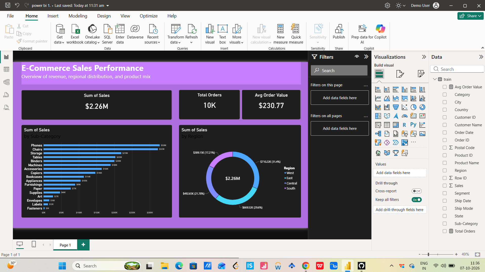

# Superstore-Sales-PowerBI-Dashboard
# 🚀 E-Commerce & Retail Sales Intelligence Dashboard

A production-ready Business Intelligence dashboard built in Microsoft Power BI to monitor executive-level KPIs, regional sales distribution, and product-level profitability for a multi-category retail enterprise.

---

## 📸 Dashboard Preview

---

## 🎯 Project Objective & Business Impact
Retail organizations often struggle with fragmented sales data, making it difficult to track high-performing product lines and regional revenue contributions in real time. 
* **The Solution:** Developed an end-to-end analytical dashboard featuring a modern corporate dark-theme UI to provide executives with instant visibility into core financial metrics.
* **Key Impact:** Streamlined performance tracking across **$2.26M in total revenue** and **10K+ transactions**, enabling data-driven inventory and regional marketing decisions.

---

## 📊 Key Performance Indicators & Core Features
* **Executive KPI Cards:** Real-time tracking of **Total Sales ($2.26M)**, **Total Orders (10K+)**, and **Average Order Value ($230.77)** to measure baseline customer spending behavior.
* **Product Mix Analysis (Horizontal Bar Chart):** Ranked sub-categories (highlighting top performers like *Phones* and *Chairs*) to identify high-margin product segments and optimize inventory stocking.
* **Geographic Distribution (Donut Chart):** Mapped regional market penetration across West, East, Central, and South regions to pinpoint key revenue-generating territories.

---

## 🛠️ Technical Implementation & Workflow
1. **Data Ingestion & Cleaning:** Handled raw transactional data (`train.csv`), checked for anomalies, and structured data types.
2. **Data Modeling & Measures:** Implemented explicit/implicit measures and optimized table relationships for faster query performance.
3. **UI/UX & Design Architecture:** 
   * Designed a **Corporate Dark Theme** to reduce eye strain and highlight data contrast.
   * Applied strict visual hierarchy, custom card padding, and subtle borders for a clean, executive finish.

---

## 📂 Repository Structure
* `train.csv` — Cleaned raw dataset used for visualization.
* `power bi 1.pbix` — Complete, interactive Power BI source file.
* `Screenshot 2026-10-07 113612.png` — High-resolution visual export of the final dashboard.

---

## 👩‍💻 About the Author
**Nitu Kumari**  
*B.Tech in Artificial Intelligence and Data Science* | *Data Science & Analytics Intern*  
[GitHub Profile](https://github.com/nitu-choubey)
